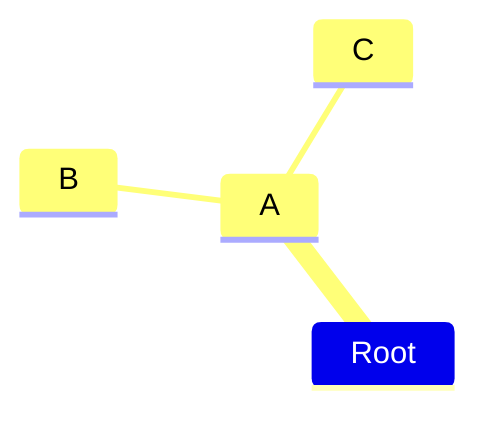

《定位》- 万物皆可定位 第三次生产力革命

## 书的基本信息

- 作者：特劳特 艾里斯
- 2017-09

## 自身收货和思考

> 阅读目标：理解营销理念的不同，为何“占据用户心智”那么重要

### 关于定位的一些浅见

《定位》这本书是营销中经典书籍。表明了一种观点：如何抢占用户或者客户的心智空间。做品牌做产品是每个商家都在做的事、但是占据顾客的大脑、寻找有效营销的出发点是十分重要的。正是因为消费者的大脑空间每天都接收的大量的信息，一个产品要想被记住是很难得的。对广告视而不见听而不闻 用户记不住过多的品牌是现状。举几个例子：现在市面上各种饮料，可口可乐、王老吉（怕上火喝王老吉）等等。 正是因为“怕上火喝王老吉”这种定位才能让王老吉在众多的饮品中脱颖而出。 正确的投放广告、吸引大众注意力、降低大众的理解心智是重要的。再举个例子 ，农夫山泉有点甜 但是作为消费者的我觉得一点也不甜，但是在买水的时候不经意看到就会想到“农夫山泉有点甜”。成功的案例有阿里系的一些产品（飞猪、蚂蚁、语雀）都是一些身边的事物，甚至有些都是我身边耳熟能详的小动物。他们采取的正式定位的核心内涵：尽可能不用高大上的新东西,而是用户已经了解的东西，和熟悉的事物进行联系

### 定位的几种方式策略

#### 领导者策略

某个领域的第一名总是容易别人记住， 珠穆朗玛峰第一高峰、某个品类的第一名、各种选秀节目的冠军。把自己的品牌做成行业中的代表性品牌或者让用户以为是第一名也行。 不断重复自己的定位 领导者认知。举个例子：“百度一下你就知道”这正是百度在不断的强化人们的认知。 还有“全国销量领先的红罐凉茶“ 这些案例表明产品都在下意识的加强用户心智中的 No.1 概念

#### 跟随者策略

如果一个行业已经有头部的定位，可以寻找另一个新的方向，寻找新的空位，就像可口可乐和百事可乐，百事可乐更是强调在年轻人中的定位，占据更多年轻人的时长

#### 重新定位对手

不仅要定位自己还要定位竞争对手。重新定位对手，更有甚者把对手拉下马。通过重新定位对手的品牌让大众觉得对手的品牌好像有些问题。比如神州专车打出更安全，在手机市场老罗说，现在市面上的手机是对对审美的妥协等等

### 定位的四步法则

- 分析外部的环境
- 避开竞争对手在顾客中的强势
- 为定位寻找信任状
- 定位整合进企业内部运营

## 关键脉络

